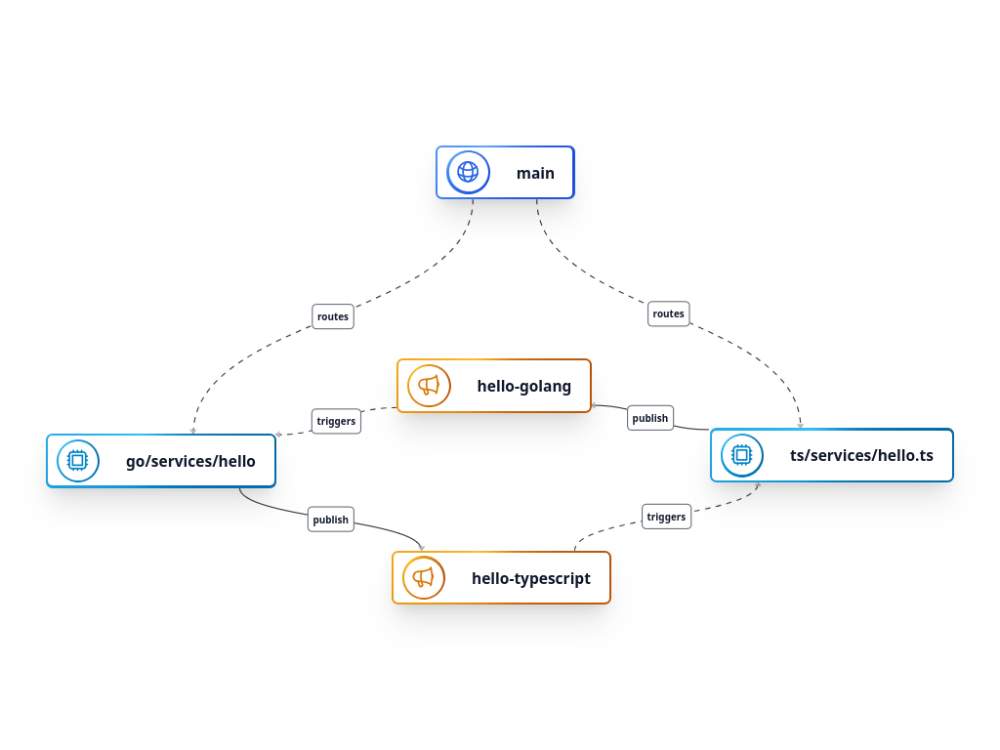

<p align="center"><a href="https://nitric.io" target="_blank"></a></p>

## Nitric Multi-Language Example

An example of a polyglot nitric mono repo written in Typescript and Golang, that demonstrates interservice communication via Topics.



## Running this project

To run this project you'll need the [Nitric CLI](https://nitric.io/docs/installation) installed, then you can use the CLI commands to run, build or deploy the project.

You'll also want to make sure the project's required dependencies have been installed for the golang and typescript projects.

```bash
# install node dependencies
cd ts
npm install
```

```bash
# install go dependencies
cd go
go mod tidy
```

```bash
# run locally (from project root)
nitric start
```

## Learn more about Nitric

Nitric provides detailed and intuitive [documentation](https://nitric.io/docs) and [guides](https://nitric.io/docs/getting-started) to help you get started quickly.

If you'd rather chat with the maintainers or community, come and join our [Discord](https://nitric.io/chat) server, [GitHub Discussions](https://github.com/nitrictech/nitric/discussions) or find us on [Twitter](https://twitter.com/nitric_io).


